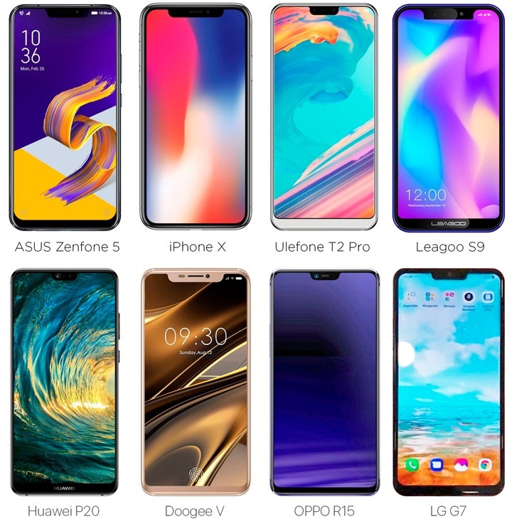
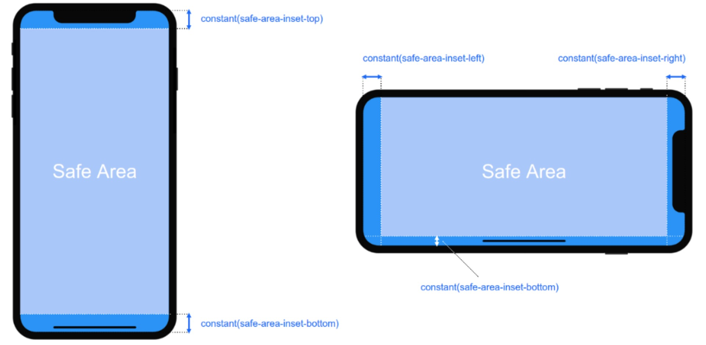

# h5适配齐刘海手机app webview

[TOC]
## 1、刘海手机示意图


<br />


<br />
  

## 2、css适配iphoneX
```css
/* iOS 11 iphoneX */
padding-top: constant(safe-area-inset-top); /* 竖屏 */
padding-right: constant(safe-area-inset-right); /* 横屏 */
padding-bottom: constant(safe-area-inset-bottom); /* 竖屏 */
padding-left: constant(safe-area-inset-left); /* 横屏 */

/* iOS 11.2+ iphoneX */
padding-top: env(safe-area-inset-top); /* 竖屏 */
padding-right: env(safe-area-inset-right); /* 横屏 */
padding-bottom: env(safe-area-inset-bottom); /* 竖屏 */
padding-left: env(safe-area-inset-left); /* 横屏 */
```

## 3、safe-area-inset-top ／ safe-area-inset-bottom
- safe-area-inset-top 测试iphoneX为44dp 设备像素
- safe-area-inset-bottom 测试iphoneX为34dp 设备像素


## 4、开课啦app/教师端app webview适配方案思考

-  css适配iphoneX的属性需要原生webview支持，且适配安卓刘海手机暂无css支持
-  通过原生获取我们想要的safe-area-inset-top值，由于底部布局适配的复杂性，安卓的safe-area-inset-bottom视为iphoneX 44dp，统一
-  由于安卓safe-area-inset-top的不确定性，增加isFringe标志（是否刘海屏）
-  增加safe-el样式类，设置padding-bottom为手机安全区域距离屏幕下边的距离


## 5、公共组件NavBar

设计以iphone6为基准，菜单栏高度为44dp
组件结构分为 左，中，右插槽自定义内容，默认为返回键，标题(展示不下...)，无

```html
<div class="page-nav-bar">
  <div class="page-nav-bar-left" @click="slide(to)">
    <slot name="left">
      <i class="page-nav-bar__arrow iconfont icon-back-arrow"></i>
    </slot>
  </div>

  <div class="page-nav-bar-center">
    <slot>
      <div class="page-nav-bar__title">{{title}}</div>
    </slot>
  </div>

  <div class="page-nav-bar-right">
    <slot name="right"></slot>
  </div>
</div>
```
```js
export default {}
```

stylus语法
```css
.page-nav-bar {
  display flex 
  align-items center
  height 88px

  &-left, &-right {
    min-width 96px
  }

  &__arrow {
    font-size 36px; /*px*/
    color #fff
  
    padding 0 30px    

    display inline-block
    line-height 88px
    text-align center
  }
  
  &-center {
    flex 1
    overflow-x hidden
    text-align center
    color #fff
    font-size 36px; /*px*/
  }
  
  &__title {
    white-space nowrap
    overflow hidden
    text-overflow ellipsis
  }
}
```
## 6、公共组件Layout

- 对于非刘海屏手机不受影响（头部、底部渐进增强）
- 定义一个顶部安全区域元素，默认为以iphone6为标准的状态栏高度20dp(padding-top表示)，不支持沉浸式的安卓4.4以下手机 为隐藏状态，微信环境下为隐藏状态，刘海屏手机目前是通过userAgent(之前想法是通过jsbridge获取safeInsetTop后重绘，重绘体验不好，弃用)获取safeInsetTop值同步顶部安全区域元素padding-top值，scroller元素top值
- 适配webview底部，在刘海屏手机app webview中，手机安全区域距离屏幕下边的距离统一为34dp，scroller元素fixed定位bottom为34dp，另外增加一个safe-el的样式类padding-bottom为34dp，根据视觉ui效果微调 安全区域距离屏幕下边的距离由34dp微调为20dp

```html
<div :class="['page-layout', { 'hidden': !safeAreaInsetTopStyle }]">
  <div class="page-layout-topbar fixed">
    <div 
      class="safe-area-inset-top" 
      v-if="safeAreaInsetTopVisible"
      :style="[ safeAreaInsetTopStyle ]">
    </div>

    <slot name="header"></slot>
  </div>

  <div class="page-layout-scroller fixed" :style="[ scrollerStyle ]">
    <slot></slot>
  </div>

  <div class="page-layout-footerbar">
    <slot name="footer"></slot>
  </div>
</div>
```
stylus
```css
.fringe-screen {
  /* 以iphoneX为准，安全区域距离屏幕下边的距离为34dp，这里微调为20dp，以实际视觉效果为准 */
  .page-layout-scroller {
    bottom: 40px!important;
  }
  /* 以iphoneX为准，安全区域距离屏幕下边的距离为34dp，这里微调为20dp，以实际视觉效果为准 */
  .safe-el  {
    box-sizing content-box!important;
    padding-bottom 40px!important;
  }
}

[data-dpr="1"] .fringe-screen {
  /* 以iphoneX为准，安全区域距离屏幕下边的距离为34dp，1倍的安卓统一处理为34dp */
  .page-layout-scroller {
    bottom: 34px!important;
  }
  /* 以iphoneX为准，安全区域距离屏幕下边的距离为34dp，1倍的安卓统一处理为34dp */
  .safe-el {
    box-sizing content-box!important;
    padding-bottom 34px!important;
  }
}
```

stylus scoped
```css
.page-layout {
  position fixed
  left 0px
  top 0px
  right 0px
  bottom 0px
  background-color #f5f5f5

  &.hidden {
    visibility hidden
  }
  
  &-topbar {
    background-color #6eb92b
    
    &.fixed {
      position fixed
      top 0px
      left 0px
      width 100%
    }
    
    .safe-area-inset-top {
      width 100%
      height 0
      overflow hidden
      
      /* iphone6 状态栏默认40物理像素 */
      padding-top 40px
    }
  }

  &.wechart-env &-scroller {
    top: 0px!important;
  }

  &-scroller {
    color #333
    background-color #fff
    overflow-x hidden
    overflow-y scroll
    -webkit-overflow-scrolling touch
    /* iphone6 状态栏默认40物理像素，菜单栏88物理像素 */
    top 128px
    bottom 0px
  
    &.fixed {
      position absolute
      left 0px
      right 0px
    }

    /* 不设置height: 100%, 业务页面中bottom需根据footerBar高来设置 */
    &>*:first-child {
      position absolute
      left 0px
      top 0px
      right 0px
      // bottom 0px
      width 100%
      overflow-x hidden
      overflow-y scroll
      -webkit-overflow-scrolling touch
    }
  }

  &-footerbar {
    position fixed
    bottom 0px
    left 0px
    width 100%
  }
}
```

## 7、使用示例（Layout NavBar）

主观题班级作业试题总览
```html
<div :class="['question-overview', `status${status}`, `score-status${scoreStatus}`]">
  <layout>
    <nav-bar slot="header" title="试题总览" to="native"></nav-bar>
    <div class="container-top">
      <objective-question
        v-if="pageType === 0"
        :result-data="resultData"
        :countdown="countdown">
      </objective-question>

      <subjective-question
        v-if="pageType === 1"
        :result-data="resultData"
        :countdown="countdown">
      </subjective-question>

      <all-question
        v-if="pageType === 2"
        :result-data="resultData"
        :countdown="countdown">
      </all-question>
    </div>

    <div slot="footer" class="footer-btns" v-if="pageType !== -1">
      <div
        class="btn safe-el"
        v-if="canAnswerQuestion"
        @click="slideIn('/aladdin/view/answer')">
        继续答题
      </div>

      <div
        class="btn safe-el"
        v-if="canScoring"
        @click="slideIn('/aladdin/view/score')">
        继续打分
      </div>

      <div
        class="btn safe-el"
        v-if="canViewAnalyze"
        @click="slideIn({ path: '/aladdin/view/analyze', query: { status } })">
        查看解析
      </div>

      <div class="btn safe-el disabled" v-if="publicityAnswerTimeStr">
        {{ publicityAnswerTimeStr }}公布答案
      </div>
    </div>
  </layout>
</div>
```

主观题班级作业答题页
```html
<div class="answer-question-page">
  <layout>
    <nav-bar slot="header" title="答题" :to="back">
      <div :class="['submit-btn', { 'active': answers.length > 0 && submitSuccess === false }] " slot="right" @click="submit">提交</div>
    </nav-bar>

    <div class="content-body" v-if="questions && questions.length > 0">
      <auto-timing
        ref="autoTiming"
        v-if="autoTimingVisible"
        :is-recover-ever="isRecoverAnswer"
        :storage-key="autoTimingStorageKey">    
      </auto-timing>

      <div class="no-more-prompt" v-if="questions && questions.length > 0">没有了～</div>
      <slide class="questions-slide"
        v-if="questions && questions.length > 0"
        ref="slide"
        :slide-change="slideChange"
        :duration="300" 
        effect="ease" 
        :init-index="slideIndex + 1"
        :loop="false" 
        :auto="false" 
        :show-btn="false" 
        :show-page="false"
        :show-page-index="false"
        :bound-rate="0.1">

        <div
          class="question-panel-wrap"
          v-for="(question, index) in questions"
          :key="index">

          <question-panel
            v-if="question.questionSubject"
            class="item-question"
            :sort="question.sort"
            :question-id="question.id"
            :type="`${parseQuestionType(question.kklQuestionType)}`"
            :type-name="question.questionTypeName"
            :question-subject="question.questionSubject"
            :options="question.options"
            :correct-answer="question.correctAnswer"
            :analyze="false"
            :disable="false"
            :not-editable="true"
            :answers="answers"
            @choose="updateAnswer">

            <my-answer-panel
              :ref="`myAnswerPanel${index}`"
              v-if="question.questionSubject && question.kklQuestionType > 3 && answers.some(ans => ans.questionId === question.id)"
              :question-id="question.id"
              :img-url="answers[answers.findIndex(ans => ans.questionId === question.id)].id"
              :allow-rotate="true"
              @update="pictureRotateUpdate">
            </my-answer-panel>
          </question-panel>
          
          <div v-if="!question.questionSubject" class="item-question item-question-placeholder"></div>
        </div>
      </slide>
    </div>

    <footer-bar
      slot="footer"
      v-if="questions && questions.length > 0"
      :question-indicator-value="`${slideIndex + 1}/${questions.length}`"
      @showAnswerQuestionCardEvent="answerQuestionCardVisible = true"
      @showFeedBackEvent="feedBackVisible = true">

      <template v-if="questions[slideIndex].kklQuestionType > 3">
        <div
          v-if="!answers.some(ans => ans.questionId === questions[slideIndex].id)"
          class="take-photo-btn"
          @click="getPictureUrl">拍照上传答案</div>
        <div
          v-else
          class="take-photo-btn take-photo-again-btn"
          @click="getPictureUrl">重新拍照上传</div>
      </template>
    </footer-bar>
  </layout>
  
  <answer-question-card
    v-if="questions && questions.length > 0"
    v-model="answerQuestionCardVisible"
    :list="questions"
    :mode="0"
    :status="0"
    :can-view-analyze="false"
    :current-question-index="slideIndex"
    @choose="slideTo">
  </answer-question-card>

  <feed-back-bar
    v-if="questions && questions.length > 0"
    :homework-id="info.homeworkId"
    :question-id="questions[slideIndex].id"
    :source="5"
    :show="feedBackVisible"
    @hide="feedBackVisible = false">
  </feed-back-bar>

  <take-photo-hint v-model="takePhotoHintVisible"></take-photo-hint>
  <swipe-gesture :visible="swipeGestureVisible"></swipe-gesture>
</div>
```